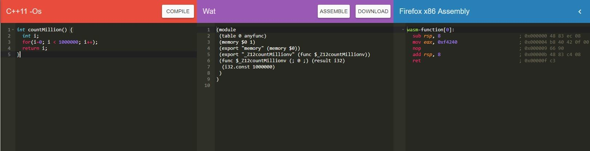

# Introduction to Web Assembly


It's always better to start with a statistics, according to the [stackoverflow survey](https://insights.stackoverflow.com/survey/2018/#technology), javascript is the most popular programming language in the world. There are number of reasons for this, such as the number of libraries, frameworks, tools available for the language, large developer community, tech giants involvement, it's ubiquitous nature (we can develop applications for different platforms using javascript, from client side, server side, mobile to raspberry pi, blockchain, machine learning development can be done through javascript) and so on. But the major reason for it's popularity is, JavaScript is the language of the web.

Javascript played a monopoly role in the client side programming paradigm all these years, many technologies almost died because of javascript, such as flash and java applets. [Google Dart](https://www.dartlang.org/) is considered as a replacement for javascript when it was launched, but it didn't able to replace javascript. In this web programming race, now we have new a sensation which is called the [Web Assembly](https://webassembly.org/).

If we consider something to replace another, then it should have something special right. So why web assembly is better than javascript, the most important advantage web assembly has over javascript is, it's speed, web assembly is extremely fast. Obviously the reason is, web assembly is a low level language, which eliminate the time for compilation.

But let's forget about the replacement of javascript for a moment, as a Javascript developer, now my intention is to find a way to integrate both web assembly and javascript together. Think of a scenario, where I am developing a javascript application, and I need to run a compute intensive function which will take a lot of time to execute in javascript, then how good it would be, if we could replace the function with web assembly and call it with javascript. This is the aim of this blog post.

In this post, I will write a function which will loop 1 million times with both in javascript and in web assembly. Then I will compare the time both javascript and web assembly took to execute the code. Even though the function is practically useless, it will be enough for you to understand the power of web assembly and how much it is useful to integrate with Javascript.

Let's start,

#### Step 1 : Write the function in Javascript.
```js{2}
function jscounter() {
    for(var i = 0; i < 1000000; i++);
    return i;
}
```
Quite straight forward, isn't it. I have a function which will loop 1 million times,.So let's write the same function in web assembly.

#### Step 2 : Write the function in Web Assembly.

Writing functions in web assembly might be difficult, since the language is low level, but the good thing about web assembly is, we can write the code in common languages such as C, C++, Rust (static type languages), and then convert it into web assembly by [some tools](https://developer.mozilla.org/en-US/docs/WebAssembly/C_to_wasm).

But in this article I have used a [online c++ to wasm converter](https://mbebenita.github.io/WasmExplorer/).



As you can see in the above image, I have written the function in C++ and compiled it, then it will provide you with the equivalent web assembly code and then you can simply download it and use it. Once you download the code, you can read the wasm file and work with that.

#### Step 3 : Integrate web assembly and Javascript.
```js{2-6}
function LoadAssembly(asmFile) {
    return fetch(asmFile)
            .then(response => response.arrayBuffer())
            .then(bytestream => WebAssembly.compile(bytestream))
            .then(module => new WebAssembly.Instance(module))
            .then(instance => instance.exports._Z12countMillionv)
}
```
Let's go through the code,

At the end, this LoadAssembly will return the web assembly function to your Javascript code, let's go through the code step by step.

- [fetch](https://developers.google.com/web/updates/2015/03/introduction-to-fetch) - fetch api is a new replacement for the XHR object to make asynchronous calls, its clean code makes it more maintainable and easy to use.
  
- If you are not familiar with the '=>' symbol, its call the [fat arrow function](https://developer.mozilla.org/en-US/docs/Web/JavaScript/Reference/Functions/Arrow_functions), which is a short form of writing function expressions, introduced with ES2015 or ES6.

Now let's come back to the code. I have already downloaded the wasm file to my project folder, then I made a fetch request to the file, fetch will always return a [promise](https://developers.google.com/web/fundamentals/primers/promises) with the [response object](https://developer.mozilla.org/en-US/docs/Web/API/Response), the response object will have the file's byte stream, so that I can read the byte stream with arrayBuffer function of response object and return it to the next promise as a argument (see how easy it is to use promise over traditional callbacks - [promise chaining](https://developers.google.com/web/fundamentals/primers/promises#chaining)), next step is compiling the byte stream and produce a web assembly module as a argument to the next promise, then we will create a instance of that module, with that instance we can use all the functions in that Web Assembly module.

Finally, we need to know the function name that we need to call, to find that we can use the web assembly code, if you see in the above image, look at the place where it says func and find the name. Finally, we have reached the end of the LoadAssembly function, where we have returned the web assembly counter function.

Let's call the LoadAssembly function,
```js
LoadAssembly('counter.wasm')
    .then(counter => {
        counter();
    });
```
As you can see above, we have called the LoadAssembly function and it will return the web assembly counter function, finally, I have execute the returned the function.

#### Step 4 : Evaluating the performance difference.
To evaluate the time it takes to execute the function, I have used the [time functions of the console API](https://developer.mozilla.org/en-US/docs/Web/API/Console/time), console time function is very useful when we want profile our javascript code, to refactor time consuming part of the code.

First let's evaluate javascript function.
```js
console.time('js-counter');
jscounter();
console.timeEnd('js-counter');
```
Then let's evaluate wasm function.
```js
LoadAssembly('counter.wasm')
    .then(counter => {
        console.time('wasm-counter');
        counter();
        console.timeEnd('wasm-counter');
    })
```
<br>

::: tip The final result is
js-counter: 2.39404296875ms

wasm-counter: 0.0029296875ms    
:::

As you can see in the above code, JS counter function have taken around 2.394 ms, where the wasm function has just taken 0.002 ms. In this case the web assembly code is nearly 1200 times faster than the javascript code, this ratio might change, but definitely the web assembly code will be much faster than the equivalent javascript code.

Finally, to wrap things up, it would be better to give some practical applications developed with web assembly.

Finally, to wrap things up, it would be better to give some practical applications developed with web assembly.

1. [Construct 3 Web Game Engine](https://www.construct.net/lk/blogs/construct-official-blog-1/the-future-of-the-construct-3-runtime-884)


2. [Google Earth](https://www.youtube.com/watch?time_continue=1307&v=1-g1rvkORQ8)

3. [Unity Tank Game Demo](https://webassembly.org/demo/Tanks/)

<br>

<iframe width="100%" height="400" src="https://www.youtube.com/embed/ysFJHpS-O08" frameborder="0" allow="accelerometer; autoplay; encrypted-media; gyroscope; picture-in-picture" allowfullscreen></iframe>


<br>
<br>

::: warning Final thoughts
All these years, we have written server side code for running compute intensive applications, but with the current web standards such as Web Assembly, Web GPU and etc, the gap seems less and less. So it's our responsibility as a developer to utilize these features to write high performance, in-browser applications. That's it guys, cheers 😉.
:::

::: warning Note
All my code is available in [Github](https://github.com/CharlesRajendran/WebAssembly) and feel free to follow me on Github 😉.
:::